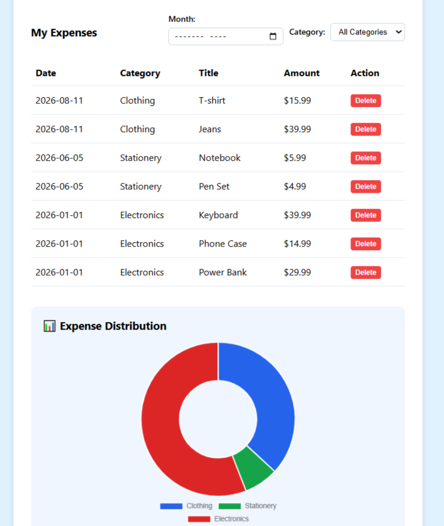

# 💰 Budget Tracker & AI Financial Advisor


A modern full-stack web application designed to track personal finances, visualize category-based spending distributions, filter transactions by date/category, and receive real-time personalized financial advice powered by **Google Gemini AI**.

---

## 📸 Dashboard Screenshots

| Dashboard Overview & AI Insights | Expense Filtering & Chart Visualization |
| :---: | :---: |
|  |  |

---

## 🌟 Key Features

- 🔐 **JWT Authentication:** Secure user registration (`Sign Up`) and login (`Sign In`) with token-based authorization.
- 💳 **Expense Management:** Full CRUD operations to add, view, and delete expenses (title, amount in $, category, date).
- 📈 **Interactive Visualizations:** Real-time **Chart.js** doughnut charts showing proportional expense distribution.
- 🔍 **Multi-Criteria Filtering:** Sift through financial history by specific **Month** (`YYYY-MM`) and **Category**.
- 💵 **Real-Time Metrics:** Live updates for total spent amounts based on active filter selections.
- 🤖 **AI Financial Advisor:** Context-aware spending insights generated dynamically via **Google Gemini API** (`gemini-3.5-flash`).

---

## 🛠️ Tech Stack & Architecture

### Backend
- **Framework:** Python / FastAPI
- **Database / ORM:** SQLModel (SQLAlchemy + Pydantic) / SQLite
- **Security:** PyJWT, Passlib (Bcrypt) for hashed authentication
- **AI Integration:** Google Gen AI SDK (`google-genai`)

### Frontend
- **Interface:** HTML5, CSS3 (Modern Flexbox/Grid)
- **Logic:** Vanilla JavaScript (ES6+ Fetch API, Dynamic DOM Manipulation)
- **Data Visualization:** Chart.js

---

## 🔌 API Architecture & Endpoints

| Method | Endpoint | Description | Auth Required |
| :--- | :--- | :--- | :---: |
| `POST` | `/users` | Register a new user account | ❌ |
| `POST` | `/login` | Authenticate user and issue JWT token | ❌ |
| `GET` | `/expenses` | Retrieve current user's expense history | Yes |
| `POST` | `/expenses` | Create a new expense entry | Yes |
| `DELETE` | `/expenses/{id}` | Remove a specific expense entry | Yes |
| `POST` | `/ai/advice` | Generate AI-driven financial advice | Yes |

---

## 🚀 Getting Started

### Prerequisites
- Python 3.10+
- Modern Web Browser
- Google Gemini API Key ([Get your key here](https://aistudio.google.com/))

### Installation & Setup

1. **Clone the Repository:**
   ```bash
   git clone [https://github.com/nisanurguven/budget-tracker.git](https://github.com/nisanurguven/budget-tracker.git)
   cd budget-tracker
